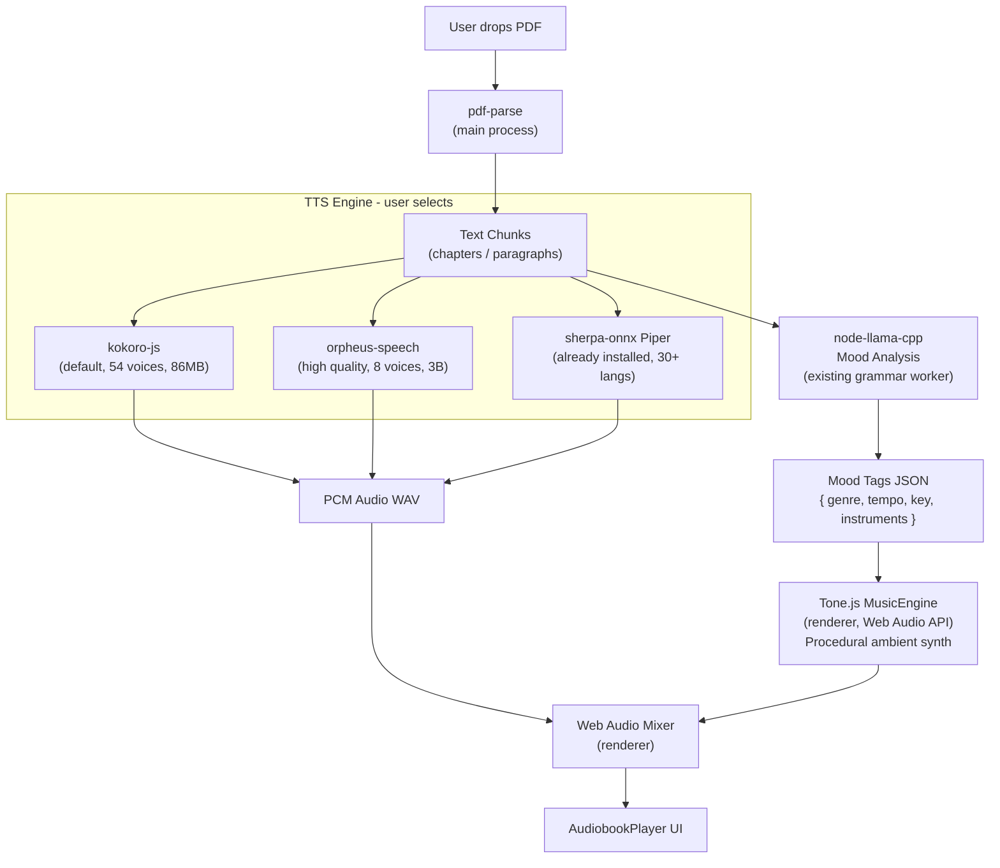

# Audiobook Feature Plan

## Local TTS Engines (100% offline)

### Primary: `kokoro-js` — Default voice engine

- **npm install**: `npm i kokoro-js` — pure JS, no native addon, no Python
- **Model**: 82M parameters, ~86MB quantized (q8f16), Apache 2.0
- **Performance**: < 2s per paragraph on CPU, WebGPU acceleration available
- **Voices**: 54 voices across 8 languages (American/British English, French, Japanese, Spanish, Korean, etc.) — `af_heart`, `af_bella`, `am_adam`, `am_echo`, `am_eric`, and more
- **Streaming**: Has `TextSplitterStream` for chunked real-time synthesis
- **Why**: Instant start, lightweight, same Node.js pattern as existing `node-llama-cpp` usage

### High Quality: `orpheus-speech` — Best local narration

- **npm package**: `orpheus-speech` (Transformers.js + ONNX, same stack as kokoro-js)
- **Model**: 3B parameters, ONNX quantized (`q4f16`)
- **Voices**: 8 human-quality voices — `tara`, `leah`, `jess`, `leo`, `dan`, `mia`, `zac`, `zoe`
- **Emotional control**: Can laugh, whisper, cry, express excitement — by far the most expressive local TTS
- **Why**: Best open-source TTS quality as of 2025, rivaling ElevenLabs — ideal for dramatic audiobook narration
- **Tradeoff**: Larger model (3B vs 82M), slower first load — user chooses this consciously as "High Quality" mode

### Fallback: `sherpa-onnx` Piper TTS — Already installed, no new deps

- `sherpa-onnx-node` is already a dependency in the app
- Supports Piper TTS models (30+ languages) — useful for non-English books
- Models downloaded same way as existing ASR models

---

## Background Music (100% offline)

### How it works

1. **Mood analysis**: The existing `node-llama-cpp` (already in the app) reads the current text chunk and outputs a small JSON of atmosphere tags:

```
   { "genre": "tense thriller", "tempo": 60, "key": "minor", "instruments": ["low strings", "heartbeat"], "energy": 2 }
   

```

1. **Tone.js synthesis**: The renderer uses `tone` (Tone.js / Web Audio API) to generate procedural ambient music from those tags in real time — no downloads, no extra hardware
2. **Presets**: A library of Tone.js synthesizer presets mapped to genres: suspense (slow minor pad + heartbeat pulse), action (driving drums + bass), romance (soft piano + strings), adventure (brass stabs + percussion), etc.
3. **Crossfade**: Music crossfades smoothly as the mood changes between paragraphs/chapters
4. **Mix control**: Separate volume sliders for voice and music — music defaults to ~20% volume so it never overpowers narration

---

## Architecture




---

## New Files

- `src/main/audiobook.js` — PDF parsing, chapter splitting, IPC handlers, SQLite book records
- `src/main/tts-engine.js` — Unified TTS worker: kokoro-js (default) + orpheus-speech (high quality), serialized queue, WAV caching (mirrors `grammar-worker.js` pattern)
- `src/renderer/src/components/audiobook/AudiobookPage.tsx` — Main page: PDF import, book library, chapter list
- `src/renderer/src/components/audiobook/AudiobookPlayer.tsx` — Playback controls: play/pause, speed, chapter nav, voice picker, music volume
- `src/renderer/src/components/audiobook/MusicEngine.ts` — Tone.js procedural ambient synthesis, mood-tag-to-preset mapping, crossfade logic
- `src/renderer/src/components/models/AudiobookModelsTab.tsx` — "Audio Books" tab content in the Models page: Kokoro + Orpheus model cards with download/remove, identical `Well`/`WellCard`/`WellItem` pattern as existing `ModelCards.tsx`

## Modified Files

- `[src/main/index.js](src/main/index.js)` — Register IPC handlers: `audiobook:load`, `audiobook:synthesize`, `audiobook:analyze-mood`, `tts-model:download`, `tts-model:status`
- `[src/preload/index.js](src/preload/index.js)` — Expose `window.tellaflow.audiobook.*` and `window.tellaflow.ttsModels.*` IPC surface
- `[src/renderer/src/components/layout/Sidebar.tsx](src/renderer/src/components/layout/Sidebar.tsx)` — Add "Audiobooks" nav entry with a book icon
- `[src/main/grammar.js](src/main/grammar.js)` — Add mood-analysis and character-detection prompt templates
- `[src/renderer/src/components/models/ModelsPage.tsx](src/renderer/src/components/models/ModelsPage.tsx)` — Add `'audiobooks'` to the `Tab` type union, add "Audio Books" tab button alongside "Transcription" and "AI Grammar", render `<AudiobookModelsTab>` when active

## New Dependencies

- `pdf-parse` — PDF text extraction, pure JS, Node.js main process
- `kokoro-js` — Default TTS, 54 voices, 86MB model download on first use
- `orpheus-speech` — High quality TTS, 8 emotional voices, 3B ONNX model
- `tone` — Procedural audio synthesis in renderer (Web Audio API wrapper)

---

## Key Implementation Details

### PDF Loading Flow

1. User opens file picker → selects PDF
2. Main process reads PDF with `pdf-parse`, extracts per-page text
3. LLM (existing `node-llama-cpp`) identifies chapter boundaries from headings/structure
4. Text chunked into ~200-word segments, stored in SQLite with the book record

### TTS Synthesis

- `tts-engine.js` mirrors `grammar-worker.js`: serialized queue, one synthesis at a time
- Synthesizes on-demand (not the whole book upfront) for fast first-play
- Cached WAV files saved to user data folder (same as existing recording cache)
- Voice picker in UI shows all available voices per engine with a preview button

### Mood-Driven Music

- Short LLM prompt per chunk: *"Describe this passage's atmosphere in JSON with keys: genre, tempo (BPM number), key (major/minor), instruments (array), energy (1-5). JSON only."*
- ~50 token output, very fast on the grammar LLM
- `MusicEngine.ts` maps genre/instrument tags to Tone.js synth presets
- Music crossfades over 4 seconds when mood changes
- Voice and music each have their own volume sliders; music defaults to 20%

---

## UI Design Spec

Reference: ElevenLabs audiobook editor screenshots. All components from [shadcn/ui](https://ui.shadcn.com/docs/components). Minimized player uses SmoothUI [Dynamic Island](https://smoothui.dev/docs/components/dynamic-island).

### 1. "Create Audiobook" Dialog (`Dialog`)

Triggered from a "New Audiobook" button on the Audiobook page.

- **Header**: Title "Create audiobook" + subtitle "Create high-quality audio to export and distribute everywhere"
- `**Tabs`** (shadcn): "Upload a document" / "Import URL"
  - **Upload tab**: Drag-and-drop zone (custom styled `div` with dashed border, upload icon, supported formats: `.pdf, .epub, .txt, .html, .docx`)
  - **Import URL tab**: `Input` with placeholder `https://www.gutenberg.org/...`
- **Default voice**: A button showing the selected voice name + avatar that opens the **Voice Picker Panel** (see §4)
- **Auto-assign voices**: `Switch` + `Badge` labeled "Alpha" — uses the existing `node-llama-cpp` to detect character names in the text and auto-assign distinct voices to each character
- **Footer**: `Button` "Create audiobook" (primary, right-aligned) — no Publish button

### 2. Main Audiobook Editor (two-panel layout)

Mirrors the ElevenLabs editor layout exactly.

**Left panel — "Edit Speech" (`w-56`, fixed)**

- Section: **Playback**
  - Volume: `Slider` + percentage display
  - Fade In / Fade Out: `Slider` with seconds display
- `Separator`
- Section: **Voice Engine**
  - `Select`: "Standard (Kokoro)" / "High Quality (Orpheus)"
  - Voice row: avatar + name + "Change" `Button` — opens the **Voice Picker Panel** (see §4)
- `Separator`
- Section: **Background Music**
  - `Switch` on/off
  - `Slider` for music volume (0–100)
  - Current mood label (e.g. "Suspense")
- `Separator`
- Section: **Speed**
  - `Slider` 0.75x – 2x
- `Separator`
- Section: **Generation History** — list of past synthesis runs with timestamp + play button
- `Separator`
- Section: **AI Tools**
  - `Button` ghost: "Enhance text" (improves punctuation/readability via LLM)
  - `Button` ghost: "Detect characters" (runs auto-assign voices)

**Right panel — Book content (`flex-1`, scrollable)**

- Book title, author, metadata rendered as styled headings
- Chapter headings (`h2` style) auto-detected
- Body text in readable prose style with `ScrollArea`
- Currently-playing sentence highlighted in real time (underline + muted background)
- Toolbar top-right: Regenerate `Button`, chapters list icon, settings icon

**Bottom — Playback bar (fixed, full width)**

- Left: Skip back (`Button` icon), Play/Pause (`Button` icon, large), Skip forward (`Button` icon), Speed display
- Center: Current time / total duration, waveform/progress `Slider`
- Right: Volume icon, music note icon toggle
- Waveform: custom `canvas` element showing audio amplitude visualization with playhead

### 3. Voice Picker Panel (`Sheet` — slides in from the right)

Reference: ElevenLabs "Select a voice" panel screenshot. Triggered from the voice button in the dialog or the "Change" button in the left panel.

**Header row**

- Back arrow `Button` + "Select a voice" title

**Tabs** (same animated-underline pattern as `ModelsPage.tsx`):

- **Explore** — full voice library from the active engine
- **My Voices** — favorited / recently used voices
- **Default** — currently active voice highlighted

**Search + Filter row**

- `Input` with search icon placeholder "Start typing to search..."
- Toggle filter chips (`Button` variant outline, small): `+ Engine`, `+ Gender`, `+ Language`, `+ Accent`

**Voice list** (`ScrollArea`, full remaining height)

Each row contains:

- **Avatar**: colored circle with initials, deterministically generated color per voice name (matches the ElevenLabs gradient-bubble aesthetic)
- **Voice name** (bold): friendly name, e.g. "Bella", "Tara", "George"
- **Subtitle**: language · accent · gender (e.g. "American English · Female · Warm")
- **Preview `Button*`* (play icon): calls a lightweight IPC handler `tts:preview` that synthesizes ~6 words ("The quick brown fox jumps") with that voice and streams the PCM audio back to play in the renderer — debounced, cancels previous preview
- **Select action**: clicking the row selects the voice and closes the panel

**Kokoro voice roster** (54 voices, key ones listed):

- `af_heart` → "Heart" · American · Female · Warm
- `af_bella` → "Bella" · American · Female · Expressive
- `af_nicole` → "Nicole" · American · Female · Soft
- `af_sky` → "Sky" · American · Female · Bright
- `af_sarah` → "Sarah" · American · Female · Clear
- `am_adam` → "Adam" · American · Male · Deep
- `am_echo` → "Echo" · American · Male · Clear
- `am_eric` → "Eric" · American · Male · Neutral
- `am_liam` → "Liam" · American · Male · Casual
- `bf_emma` → "Emma" · British · Female · Warm
- `bf_isabella` → "Isabella" · British · Female · Refined
- `bm_george` → "George" · British · Male · Distinguished
- `bm_lewis` → "Lewis" · British · Male · Calm
- *(+ remaining multilingual voices: French, Japanese, Spanish, Korean etc.)*

**Orpheus voice roster** (8 voices):

- `tara` → "Tara" · American · Female · Natural
- `leah` → "Leah" · American · Female · Expressive
- `jess` → "Jess" · American · Female · Bright
- `mia` → "Mia" · American · Female · Soft
- `zoe` → "Zoe" · American · Female · Warm
- `leo` → "Leo" · American · Male · Deep
- `dan` → "Dan" · American · Male · Clear
- `zac` → "Zac" · American · Male · Energetic

### 4. Dynamic Island — Minimized Player

Uses the SmoothUI [Dynamic Island](https://smoothui.dev/docs/components/dynamic-island) component. Shown when the user navigates away from the Audiobook page while audio is playing (similar to the existing toast window).

Contents:

- Book cover icon (auto-generated color avatar from book title initials)
- Book title (truncated)
- Play/Pause button
- `Progress` bar (thin, linear)

Clicking the island navigates back to the Audiobook page and expands it.

---

## Phased Rollout

- **Phase 1**: "Create Audiobook" dialog + PDF/URL import + Kokoro TTS narration, basic playback bar
- **Phase 2**: Left panel controls (volume, speed, voice picker), chapter detection, text highlight sync
- **Phase 3**: Orpheus "High Quality" engine toggle + character auto-assign voices
- **Phase 4**: Mood analysis + Tone.js ambient music engine + Dynamic Island minimized player

